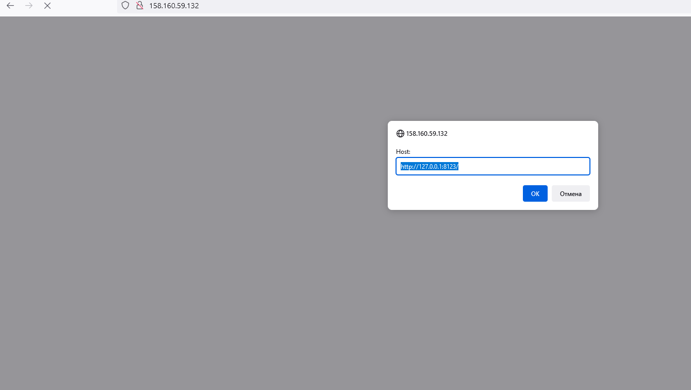

# Домашнее задание к занятию "08.03 Использование Yandex Cloud"

## Подготовка к выполнению  
Плейбук:  
https://github.com/aleks-sh-devops/08-ansible-03-yandex
## Основная часть
1. Допишите playbook: нужно сделать ещё один play, который устанавливает и настраивает lighthouse.
2. При создании tasks рекомендую использовать модули: `get_url`, `template`, `yum`, `apt`.
3. Tasks должны: скачать статику lighthouse, установить nginx или любой другой webserver, настроить его конфиг для открытия lighthouse, запустить webserver.
**Есть**  


4. Приготовьте свой собственный inventory файл `prod.yml`.
5. Запустите `ansible-lint site.yml` и исправьте ошибки, если они есть.
```
 ansible-lint site.yml

yaml: truthy value should be one of [false, true] (truthy)
site.yml:221

yes => true
```

6. Попробуйте запустить playbook на этом окружении с флагом `--check`.
```
[WARNING]: Invalid characters were found in group names but not replaced, use -vvvv to see details

PLAY [Install Clickhouse] *******************************************************************************************************************************************************************************************************************

TASK [Gathering Facts] **********************************************************************************************************************************************************************************************************************
ok: [clickhouse-01]

TASK [Get clickhouse distrib] ***************************************************************************************************************************************************************************************************************
changed: [clickhouse-01] => (item=clickhouse-client)
changed: [clickhouse-01] => (item=clickhouse-server)
failed: [clickhouse-01] (item=clickhouse-common-static) => {"ansible_loop_var": "item", "changed": false, "dest": "./clickhouse-common-static-22.3.3.44.rpm", "elapsed": 0, "item": "clickhouse-common-static", "msg": "Request failed", "response": "HTTP Error 404: Not Found", "status_code": 404, "url": "https://packages.clickhouse.com/rpm/stable/clickhouse-common-static-22.3.3.44.noarch.rpm"}

TASK [Get clickhouse distrib] ***************************************************************************************************************************************************************************************************************
changed: [clickhouse-01]

TASK [Install clickhouse packages] **********************************************************************************************************************************************************************************************************
fatal: [clickhouse-01]: FAILED! => {"changed": false, "msg": "No RPM file matching 'clickhouse-common-static-22.3.3.44.rpm' found on system", "rc": 127, "results": ["No RPM file matching 'clickhouse-common-static-22.3.3.44.rpm' found on system"]}

PLAY RECAP **********************************************************************************************************************************************************************************************************************************
clickhouse-01              : ok=2    changed=1    unreachable=0    failed=1    skipped=0    rescued=1    ignored=0
```

Ошибка происходит из-за того, что ключ чек не изменяет ничего (в том числе не устанавливает пакеты), но прогоняет плейбук!  

7. Запустите playbook на `prod.yml` окружении с флагом `--diff`. Убедитесь, что изменения на системе произведены.
```
[WARNING]: Invalid characters were found in group names but not replaced, use -vvvv to see details

PLAY [Install Clickhouse] *******************************************************************************************************************************************************************************************************************

TASK [Gathering Facts] **********************************************************************************************************************************************************************************************************************
ok: [clickhouse-01]

TASK [Get clickhouse distrib] ***************************************************************************************************************************************************************************************************************
changed: [clickhouse-01] => (item=clickhouse-client)
changed: [clickhouse-01] => (item=clickhouse-server)
failed: [clickhouse-01] (item=clickhouse-common-static) => {"ansible_loop_var": "item", "changed": false, "dest": "./clickhouse-common-static-22.3.3.44.rpm", "elapsed": 0, "item": "clickhouse-common-static", "msg": "Request failed", "response": "HTTP Error 404: Not Found", "status_code": 404, "url": "https://packages.clickhouse.com/rpm/stable/clickhouse-common-static-22.3.3.44.noarch.rpm"}

TASK [Get clickhouse distrib] ***************************************************************************************************************************************************************************************************************
changed: [clickhouse-01]

TASK [Install clickhouse packages] **********************************************************************************************************************************************************************************************************
fatal: [clickhouse-01]: FAILED! => {"changed": false, "msg": "No RPM file matching 'clickhouse-common-static-22.3.3.44.rpm' found on system", "rc": 127, "results": ["No RPM file matching 'clickhouse-common-static-22.3.3.44.rpm' found on system"]}

PLAY RECAP **********************************************************************************************************************************************************************************************************************************
clickhouse-01              : ok=2    changed=1    unreachable=0    failed=1    skipped=0    rescued=1    ignored=0

usrcon@ansible-test:~/08-ansible-03-yandex/playbook$ ansible-playbook -i inventory/prod.yml site.yml --diff
[WARNING]: Invalid characters were found in group names but not replaced, use -vvvv to see details

PLAY [Install Clickhouse] *******************************************************************************************************************************************************************************************************************

TASK [Gathering Facts] **********************************************************************************************************************************************************************************************************************
ok: [clickhouse-01]

TASK [Get clickhouse distrib] ***************************************************************************************************************************************************************************************************************
changed: [clickhouse-01] => (item=clickhouse-client)
changed: [clickhouse-01] => (item=clickhouse-server)
failed: [clickhouse-01] (item=clickhouse-common-static) => {"ansible_loop_var": "item", "changed": false, "dest": "./clickhouse-common-static-22.3.3.44.rpm", "elapsed": 0, "item": "clickhouse-common-static", "msg": "Request failed", "response": "HTTP Error 404: Not Found", "status_code": 404, "url": "https://packages.clickhouse.com/rpm/stable/clickhouse-common-static-22.3.3.44.noarch.rpm"}

TASK [Get clickhouse distrib] ***************************************************************************************************************************************************************************************************************
changed: [clickhouse-01]

TASK [Install clickhouse packages] **********************************************************************************************************************************************************************************************************
changed: [clickhouse-01]

TASK [Enable service clickhouse-server] *****************************************************************************************************************************************************************************************************
changed: [clickhouse-01]

RUNNING HANDLER [Start clickhouse service] **************************************************************************************************************************************************************************************************
changed: [clickhouse-01]

TASK [wait 10 sec] **************************************************************************************************************************************************************************************************************************
Pausing for 10 seconds
(ctrl+C then 'C' = continue early, ctrl+C then 'A' = abort)
ok: [clickhouse-01]

TASK [Create database] **********************************************************************************************************************************************************************************************************************
changed: [clickhouse-01]

TASK [Create database2] *********************************************************************************************************************************************************************************************************************
changed: [clickhouse-01]

TASK [Create database3] *********************************************************************************************************************************************************************************************************************
changed: [clickhouse-01]

PLAY [Install Vector] ***********************************************************************************************************************************************************************************************************************

TASK [Gathering Facts] **********************************************************************************************************************************************************************************************************************
ok: [vector-01]

TASK [Vector Install package] ***************************************************************************************************************************************************************************************************************
changed: [vector-01]

TASK [Configure Vector | Template config] ***************************************************************************************************************************************************************************************************
--- before: /etc/vector/vector.toml
+++ after: /home/usrcon/.ansible/tmp/ansible-local-119918pgkvdyis/tmpal8k1jjx/vector.toml.j2
@@ -42,3 +42,19 @@
 #[api]
 #enabled = true
 #address = "127.0.0.1:8686"
+
+[sources.nginx_logs]
+type = "file"
+include = [ "/var/log/nginx/vkcom_lighthouse-access.log" ]
+read_from = "end"
+
+[sinks.clickhouse]
+type = "clickhouse"
+inputs = ["nginx_logs"]
+endpoint = "http://127.0.0.1:8123"
+database = "nginxdb"
+table = "access_logs"
+skip_unknown_fields = true
+
+
+

changed: [vector-01]

RUNNING HANDLER [restart vector service] ****************************************************************************************************************************************************************************************************
changed: [vector-01]

RUNNING HANDLER [enable service Vector] *****************************************************************************************************************************************************************************************************
changed: [vector-01]

PLAY [Install nginx and ighthouse] **********************************************************************************************************************************************************************************************************

TASK [Gathering Facts] **********************************************************************************************************************************************************************************************************************
ok: [nginx-lighthouse-01]

TASK [install epel-release] *****************************************************************************************************************************************************************************************************************
changed: [nginx-lighthouse-01]

TASK [install nginx] ************************************************************************************************************************************************************************************************************************
changed: [nginx-lighthouse-01]

TASK [Disable SELinux] **********************************************************************************************************************************************************************************************************************
[WARNING]: SELinux state temporarily changed from 'enforcing' to 'permissive'. State change will take effect next reboot.
changed: [nginx-lighthouse-01]

TASK [Create a directory if it does not exist] **********************************************************************************************************************************************************************************************
--- before
+++ after
@@ -1,4 +1,4 @@
 {
     "path": "/var/www/vkcom_lighthouse/content",
-    "state": "absent"
+    "state": "directory"
 }

changed: [nginx-lighthouse-01]

TASK [install git] **************************************************************************************************************************************************************************************************************************
changed: [nginx-lighthouse-01]

TASK [copy lighthouse service from git] *****************************************************************************************************************************************************************************************************
>> Newly checked out d701335c25cd1bb9b5155711190bad8ab852c2ce
changed: [nginx-lighthouse-01]

TASK [copy lighthouse files1 to nginx workdir] **********************************************************************************************************************************************************************************************
changed: [nginx-lighthouse-01] => (item=js)
changed: [nginx-lighthouse-01] => (item=app.js)
changed: [nginx-lighthouse-01] => (item=index.html)
changed: [nginx-lighthouse-01] => (item=jquery.js)

TASK [copy lighthouse files2 to nginx workdir] **********************************************************************************************************************************************************************************************
changed: [nginx-lighthouse-01] => (item=css)
changed: [nginx-lighthouse-01] => (item=img)

TASK [create lighthouse config] *************************************************************************************************************************************************************************************************************
--- before
+++ after: /home/usrcon/.ansible/tmp/ansible-local-119918pgkvdyis/tmpo_ayxh49/lighthouse.conf.j2
@@ -0,0 +1,8 @@
+server {
+    listen       80;
+#    server_name   vkcom_lighthouse;
+    root /var/www/vkcom_lighthouse/content;
+    index index.html index.htm;
+    access_log  /var/log/nginx/vkcom_lighthouse-access.log main;
+    error_log /var/log/nginx/vkcom_lighthouse-error.log;
+}

changed: [nginx-lighthouse-01]

RUNNING HANDLER [start nginx service] *******************************************************************************************************************************************************************************************************
changed: [nginx-lighthouse-01]

RUNNING HANDLER [restart nginx service] *****************************************************************************************************************************************************************************************************
changed: [nginx-lighthouse-01]

RUNNING HANDLER [setenforce] ****************************************************************************************************************************************************************************************************************
changed: [nginx-lighthouse-01]

PLAY RECAP **********************************************************************************************************************************************************************************************************************************
clickhouse-01              : ok=9    changed=7    unreachable=0    failed=0    skipped=0    rescued=1    ignored=0
nginx-lighthouse-01        : ok=13   changed=12   unreachable=0    failed=0    skipped=0    rescued=0    ignored=0
vector-01                  : ok=5    changed=4    unreachable=0    failed=0    skipped=0    rescued=0    ignored=0

ssh test@158.160.59.122
[usrcon@fhmkt3h5vm6sn8hko8uq ~]$
[usrcon@fhmkt3h5vm6sn8hko8uq ~]$ sudo -i

fhmkt3h5vm6sn8hko8uq.auto.internal :) show databases;

SHOW DATABASES

Query id: c94cb0d4-c8b8-4396-a270-f8f59edf85dc

┌─name───────────────┐
│ INFORMATION_SCHEMA │
│ default            │
│ information_schema │
│ logs               │
│ nginxdb            │
│ system             │
└────────────────────┘

6 rows in set. Elapsed: 0.001 sec.
```

8. Повторно запустите playbook с флагом `--diff` и убедитесь, что playbook идемпотентен.
```
ansible-playbook -i inventory/prod.yml site.yml --diff
[WARNING]: Invalid characters were found in group names but not replaced, use -vvvv to see details

PLAY [Install Clickhouse] *******************************************************************************************************************************************************************************************************************

TASK [Gathering Facts] **********************************************************************************************************************************************************************************************************************
ok: [clickhouse-01]

TASK [Get clickhouse distrib] ***************************************************************************************************************************************************************************************************************
ok: [clickhouse-01] => (item=clickhouse-client)
ok: [clickhouse-01] => (item=clickhouse-server)
failed: [clickhouse-01] (item=clickhouse-common-static) => {"ansible_loop_var": "item", "changed": false, "dest": "./clickhouse-common-static-22.3.3.44.rpm", "elapsed": 0, "gid": 1000, "group": "usrcon", "item": "clickhouse-common-static", "mode": "0664", "msg": "Request failed", "owner": "usrcon", "response": "HTTP Error 404: Not Found", "secontext": "unconfined_u:object_r:user_home_t:s0", "size": 246310036, "state": "file", "status_code": 404, "uid": 1000, "url": "https://packages.clickhouse.com/rpm/stable/clickhouse-common-static-22.3.3.44.noarch.rpm"}

TASK [Get clickhouse distrib] ***************************************************************************************************************************************************************************************************************
ok: [clickhouse-01]

TASK [Install clickhouse packages] **********************************************************************************************************************************************************************************************************
ok: [clickhouse-01]

TASK [Enable service clickhouse-server] *****************************************************************************************************************************************************************************************************
ok: [clickhouse-01]

TASK [wait 10 sec] **************************************************************************************************************************************************************************************************************************
Pausing for 10 seconds
(ctrl+C then 'C' = continue early, ctrl+C then 'A' = abort)
ok: [clickhouse-01]

TASK [Create database] **********************************************************************************************************************************************************************************************************************
ok: [clickhouse-01]

TASK [Create database2] *********************************************************************************************************************************************************************************************************************
ok: [clickhouse-01]

TASK [Create database3] *********************************************************************************************************************************************************************************************************************
ok: [clickhouse-01]

PLAY [Install Vector] ***********************************************************************************************************************************************************************************************************************

TASK [Gathering Facts] **********************************************************************************************************************************************************************************************************************
ok: [vector-01]

TASK [Vector Install package] ***************************************************************************************************************************************************************************************************************
ok: [vector-01]

TASK [Configure Vector | Template config] ***************************************************************************************************************************************************************************************************
ok: [vector-01]

PLAY [Install nginx and ighthouse] **********************************************************************************************************************************************************************************************************

TASK [Gathering Facts] **********************************************************************************************************************************************************************************************************************
ok: [nginx-lighthouse-01]

TASK [install epel-release] *****************************************************************************************************************************************************************************************************************
ok: [nginx-lighthouse-01]

TASK [install nginx] ************************************************************************************************************************************************************************************************************************
ok: [nginx-lighthouse-01]

TASK [Disable SELinux] **********************************************************************************************************************************************************************************************************************
[WARNING]: SELinux state change will take effect next reboot
ok: [nginx-lighthouse-01]

TASK [Create a directory if it does not exist] **********************************************************************************************************************************************************************************************
ok: [nginx-lighthouse-01]

TASK [install git] **************************************************************************************************************************************************************************************************************************
ok: [nginx-lighthouse-01]

TASK [copy lighthouse service from git] *****************************************************************************************************************************************************************************************************
ok: [nginx-lighthouse-01]

TASK [copy lighthouse files1 to nginx workdir] **********************************************************************************************************************************************************************************************
ok: [nginx-lighthouse-01] => (item=js)
ok: [nginx-lighthouse-01] => (item=app.js)
ok: [nginx-lighthouse-01] => (item=index.html)
ok: [nginx-lighthouse-01] => (item=jquery.js)

TASK [copy lighthouse files2 to nginx workdir] **********************************************************************************************************************************************************************************************
ok: [nginx-lighthouse-01] => (item=css)
ok: [nginx-lighthouse-01] => (item=img)

TASK [create lighthouse config] *************************************************************************************************************************************************************************************************************
ok: [nginx-lighthouse-01]

PLAY RECAP **********************************************************************************************************************************************************************************************************************************
clickhouse-01              : ok=8    changed=0    unreachable=0    failed=0    skipped=0    rescued=1    ignored=0
nginx-lighthouse-01        : ok=10   changed=0    unreachable=0    failed=0    skipped=0    rescued=0    ignored=0
vector-01                  : ok=3    changed=0    unreachable=0    failed=0    skipped=0    rescued=0    ignored=0
```

9. Подготовьте README.md файл по своему playbook. В нём должно быть описано: что делает playbook, какие у него есть параметры и теги.  
**Есть**  
10. Готовый playbook выложите в свой репозиторий, поставьте тег `08-ansible-03-yandex` на фиксирующий коммит, в ответ предоставьте ссылку на него.  
**Есть**

